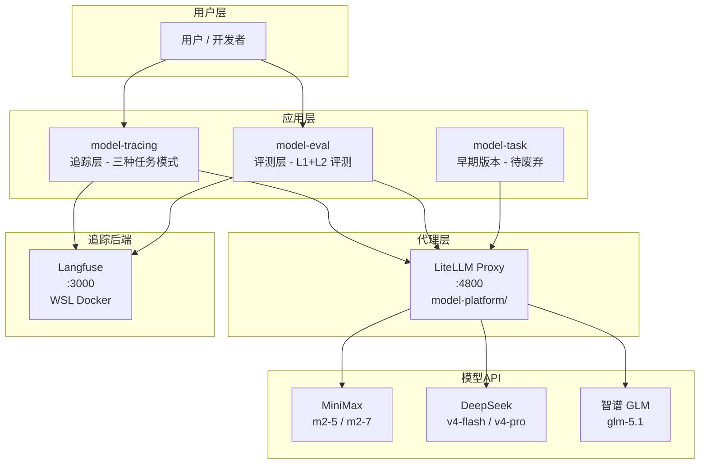

# MultiModel — 多模型统一接入与追踪系统

## 一、项目简介

MultiModel 是一个多模型统一接入、追踪与评测平台，三大核心能力：

1. **统一接入** — 通过 LiteLLM Proxy 接入多个国产/国际大模型，对外提供 OpenAI 兼容 API
2. **全链路追踪** — 通过 Langfuse 实现调用级可观测性（token 用量、延迟、状态）
3. **模型评测** — 多语言代码生成质量自动评测（L1 语法 + L2 单测）

---

## 二、整体架构



### 服务端口

| 服务 | 端口 | 运行环境 | 说明 |
|------|------|----------|------|
| LiteLLM Proxy | 4800 | Windows 本地 | 模型统一接入 |
| Langfuse Web | 3000 | WSL2 Docker | 追踪可视化 |

---

## 三、模块说明

### 3.1 `model-platform/` — 模型接入层

**职责**：通过 LiteLLM Proxy 统一接入多个大模型，对外提供 OpenAI 兼容 API。

| 项目 | 说明 |
|------|------|
| 端口 | `:4800`（默认，支持 `--port` 参数） |
| 入口 | `start_proxy.py` |
| 配置 | `config.yaml` |
| 重试策略 | 3 次，超时 120s，`drop_params: true`（自动丢弃不支持的参数） |

**辅助工具**：

| 文件 | 说明 |
|------|------|
| `create_keys.py` | 虚拟 Key 管理工具 |
| `test_call.py` | 模型调用测试脚本 |
| `test_glm.py` | 智谱模型专项测试脚本 |

### 3.2 `model-tracing/` — 追踪层（主力模块）

**职责**：封装三种任务模式 + 集成 Langfuse / Console 追踪。

**三种任务模式**：

| 模式 | 文件 | 说明 |
|------|------|------|
| Parallel（并行评测） | `tasks/parallel_task.py` | 同一 prompt 多模型并行调用，对比输出质量 |
| Pipeline（流水线） | `tasks/pipeline_task.py` | 多步骤串联（如：提取关键词 → 生成大纲 → 扩写正文） |
| SmartRoute（智能路由） | `tasks/smart_route_task.py` | 按任务类型自动选择最佳模型 |

**核心抽象层**（`core/`）：

| 文件 | 说明 |
|------|------|
| `llm_client.py` | AsyncOpenAI 统一调用客户端 |
| `tracer.py` | BaseTracer / ConsoleTracer / NoopTracer 抽象接口 |
| `langfuse_tracer.py` | Langfuse v4 API 追踪实现 |
| `tracer_factory.py` | 工厂模式，按环境变量切换追踪后端 |
| `task.py` | 任务模式枚举 + 结果数据结构 |

**追踪后端切换**（由 `.env` 中 `TRACER_BACKEND` 控制）：

| 值 | 行为 |
|----|------|
| `console` | 打印到终端（本地调试默认） |
| `langfuse` | 写入 Langfuse |
| `noop` | 不追踪 |

### 3.3 `model-eval/` — 代码生成评测层

**职责**：多语言 + 混合粒度的代码生成质量自动评测。

**评测维度**：

| 层级 | 维度 | 实现方式 | 状态 |
|------|------|----------|------|
| L1 | 语法正确性 | Python: `ast.parse` / JS: `node --check` / SQL: 正则 | 已实现 |
| L2 | 功能正确性 | Python: `exec()` 单测 / JS: `node` 子进程 / SQL: 跳过 | 已实现 |
| L3 | 需求完整性 | LLM-as-Judge | 未实现 |
| L4 | 代码质量 | LLM-as-Judge | 未实现 |

**数据集**（`datasets/code_gen_v1.json`，20 条样本）：

| 类别 | 数量 | 语言 | ID 范围 |
|------|------|------|---------|
| 简单函数 | 5 | Python | py-simple-001 ~ 005 |
| 简单函数 | 3 | JavaScript | js-simple-001 ~ 003 |
| SQL 查询 | 3 | SQL | sql-simple-001 ~ 003 |
| 中等函数 | 5 | Python | py-medium-001 ~ 005 |
| 类/模块级 | 4 | Python | py-class-001 ~ 004 |

**评测执行流程**：

```
run_eval.py
  ├── Step 1: 上传 Dataset 到 Langfuse（数据集管理）
  ├── Step 2: 逐模型跑 Experiment
  │     ├── model_fn()     ← 调用 LiteLLM Proxy 生成代码
  │     ├── evaluate()     ← L1 语法检查 + L2 单测评分（本地）
  │     └── Langfuse 写入  ← 创建 trace + generation + scores
  └── Step 3: 本地 JSON 持久化 + 打印汇总表
```

**已有评测结果**：`results/` 目录下保存了 deepseek-v4-flash 等模型的评测 JSON。

### 3.4 `model-task/` — 早期版本

与 `model-tracing/` 代码几乎完全重复，未做国产模型适配。**建议废弃或合并至 model-tracing**。

### 3.5 `scripts/` — 运维脚本

| 脚本 | 用途 |
|------|------|
| `start_langfuse.bat/ps1/sh` | 启动 Langfuse Docker |
| `full_setup.ps1` | 全栈安装 |
| `port_forward.bat` / `wsl-port-forward.ps1` | WSL → Windows 端口转发 |
| `diagnose.sh` / `check_docker.*` | Docker 全栈诊断 |
| `update_cost_map.py` | 手动同步 LiteLLM 模型定价数据 |

---

## 四、已接入模型

| 模型名 | LiteLLM 标识 | API 端点 | 厂商 |
|--------|-------------|---------|------|
| minimax-m2-5 | `openai/MiniMax-M2.5` | `https://api.minimaxi.com/v1` | MiniMax |
| minimax-m2-7 | `openai/MiniMax-M2.7` | `https://api.minimaxi.com/v1` | MiniMax |
| deepseek-v4-flash | `deepseek/deepseek-v4-flash` | DeepSeek 默认端点 | DeepSeek |
| deepseek-v4-pro | `deepseek/deepseek-v4-pro` | DeepSeek 默认端点 | DeepSeek |
| glm-5-1 | `openai/glm-5.1` | `https://api.z.ai/api/paas/v4/` | 智谱 AI |
| glm-5-2 | `openai/glm-5.2` | `https://api.z.ai/api/paas/v4/` | 智谱 AI |

---

## 五、环境配置

### 统一 `.env`（项目根目录，所有子模块共用）

```env
# 模型 API Keys
MINIMAX_API_KEY=sk-cp-...
DEEPSEEK_API_KEY=sk-...
ZAI_API_KEY=...

# LiteLLM Proxy
LITELLM_MASTER_KEY=sk-my-master-key-1234
LITELLM_BASE_URL=http://localhost:4800
LITELLM_LOCAL_MODEL_COST_MAP=True    # 跳过远程 cost map 获取，消除警告

# 追踪后端：console | langfuse | noop
TRACER_BACKEND=langfuse

# Langfuse
LANGFUSE_PUBLIC_KEY=pk-lf-...
LANGFUSE_SECRET_KEY=sk-lf-...
LANGFUSE_HOST=http://localhost:3000
```

### 依赖版本

| 依赖 | 版本要求 | 说明 |
|------|----------|------|
| openai | >=1.0.0 | OpenAI 兼容客户端 |
| litellm[proxy] | >=1.84.0 | glm-5.1 需此版本 |
| langfuse | >=2.0.0,<5.0.0 | v4 SDK |
| python-dotenv | >=1.0.0 | .env 加载 |
| requests | >=2.31.0 | Key 管理工具 |

安装依赖：

```bash
pip install -r requirements.txt
```

---

## 六、快速开始

### 前置条件

- Python 3.10+
- Node.js（可选，用于 JavaScript L1/L2 评测）
- Docker + WSL2（可选，用于运行 Langfuse）

### 1. 启动 LiteLLM Proxy

```bash
cd model-platform
python start_proxy.py --port 4800
```

### 2. 启动 Langfuse（WSL Docker）

```bash
# PowerShell
scripts\start_langfuse.bat

# 或 WSL 内
cd model-tracing
docker-compose -f langfuse-docker-compose.yml up -d
```

启动后访问 http://localhost:3000 → Settings → API Keys 获取 Key，填入 `.env`。

### 3. 运行追踪层演示

```bash
cd model-tracing
python main.py
```

演示包含：智能路由分类验证（不需要 Proxy）+ 并行评测 + 流水线任务。

### 4. 运行代码生成评测

```bash
# 仅测试评测器（不调用模型，不需要任何服务）
cd model-eval
python run_eval.py --dry-run

# 完整评测（需 LiteLLM Proxy + Langfuse 运行中）
python run_eval.py

# 指定模型
python run_eval.py --models deepseek-v4-pro minimax-m2-5

# 跳过上传（数据集已存在时）
python run_eval.py --skip-upload
```

---

## 七、智能路由规则

`SmartRouteTask` 根据输入内容自动匹配最佳模型：

| 任务类型 | 路由模型 | 匹配关键词 | 优先级 |
|----------|----------|-----------|--------|
| CODE（代码） | deepseek-v4-pro | 代码、函数、python、bug、sql... | 10 |
| ANALYSIS（分析推理） | glm-5-2 | 分析、为什么、对比、评估... | 8 |
| TRANSLATION（翻译） | minimax-m2-5 | 翻译、translate、英文、中文... | 7 |
| SUMMARIZATION（摘要） | minimax-m2-5 | 总结、摘要、归纳... | 7 |
| LONG_GENERATION（长文本） | deepseek-v4-pro | 输入长度 > 300 字符 | 3 |
| SIMPLE_QA（简单问答） | deepseek-v4-flash | 你好、什么是、解释... | 2 |
| DEFAULT（默认） | deepseek-v4-flash | 兜底匹配 | 0 |

---

## 八、已知问题与后续方向

### 待处理

| # | 问题 | 说明 |
|---|------|------|
| 1 | `model-task/` 与 `model-tracing/` 代码重复 | 建议废弃 model-task 或合并 |
| 2 | L3/L4 评测维度未实现 | 可用 LLM-as-Judge 方案 |
| 3 | SQL L2 评测跳过 | 可嵌入 SQLite 内存库 |

### 扩展方向

- **L3 需求完整性**：用 LLM-as-Judge 对比 instruction 与生成代码
- **L4 代码质量**：用 LLM-as-Judge 评分可读性、健壮性
- **SQL L2 评测**：嵌入 SQLite 内存数据库，自动执行 SQL 并比对结果
- **更多语言**：Java（javac 编译检查）、Go 等
- **接入更多模型**：国外模型（GPT-4o、Claude）路由规则已预留模板
